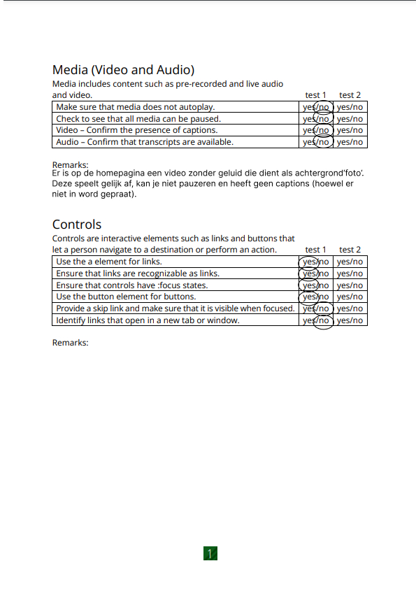

# Procesverslag
Markdown is een simpele manier om HTML te schrijven.  
Markdown cheat cheet: [Hulp bij het schrijven van Markdown](https://github.com/adam-p/markdown-here/wiki/Markdown-Cheatsheet).

Nb. De standaardstructuur en de spartaanse opmaak van de README.md zijn helemaal prima. Het gaat om de inhoud van je procesverslag. Besteedt de tijd voor pracht en praal aan je website.

Nb. Door *open* toe te voegen aan een *details* element kun je deze standaard open zetten. Fijn om dat steeds voor de relevante stuk(ken) te doen.

## Jij

  
uitwerken voor kick-off werkgroep

  ### Auteur:
  Uri Onderwijzer

  #### Je startniveau:
  Blauw

  #### Je focus:
  surface plane
  -Videos
  -extra microinteractie
  -States van controls++ (forms, inputs, links…)
  -svg icons
  -()has
 

## Je website

  
uitwerken voor kick-off werkgroep

  ### Je opdracht:
  (https://www.thenorthface.nl/)

  #### Screenshot(s) van de eerste pagina (small screen): 
  Homepagina
  

  #### Screenshot(s) van de tweede pagina (small screen):
  Heren winterschoenen pagina
  
 

## Toegankelijkheidstest 1/2 (week 1)

  
uitwerken na test in 2e werkgroep

  ### Bevindingen
  Lijst met je bevindingen die in de test naar voren kwamen:

  -Door het carrousel heen scrollen werkt erg goed, maar de alt text bij de fotos klopt soms niet, de alt text is soms iets heel anders 
   dan wat op de foto staat, zo was er bijvoorbeeld een foto van een vrouw in een groene jas, maar was de alt text een vrouw in een roze 
   t-shirt.
  -Bij het stukje waar je lid kan worden van de 'XPLR pass' kan je niet naar de heading navigeren, zelfs niet met de pijltjes, je       
   navigeert automatisch naar de knop waar 'word lid' op staat, maar je weet dan dus niet waarvan je lid word.
  -De dropdown knoppen laten goed weten of de knop wel of niet uitgevouwen is.
  -De header 'abboneer u op onze nieuwsbrief' word ook overgeslagen, je word gelijk naar het e-mail vakje gebracht.
  -Hetzelfde gebeurd bij de headers 'volg the northface' en 'vind een winkel'.
  -Het hamburger menu werkt erg goed.
  -De alt text bij fotos kan beter.

  WCAG Checklist
  
  
  
  
  

## Breakdownschets (week 1)

  (De blauwe vierkanten zijn sections)

  ### Homepagina: 
  

## Voortgang 1 (week 2)

  
uitwerken voor 1e voortgang

  ### Stand van zaken
  Het verrasde me hoe goed de code er nog inzat van vorig jaar, ik had verwacht dat ik echt met heel veel moeite weer helemaal opnieuw alles moest leren, maar de kennis van vorig jaar kwam al snel terug.
  -Waar ik moeite mee heb is nu vooral de selectoren, ik ben nu soms classes aan het gebruiken op plekken waar dit eigenlijk niet mag, ik ga dit in de latere weken oplossen en de goede selectoren gebruiken.
  -Een uitdaging die ik had was om een carrousel te maken, niet een werkende maar meer iets dat lijkt op een carrousel.
  
  De uitdaging hier was om te voorkomen dat er side-scrolling voorkwam, dit is dus ook wat er eerst gebeurde. Wat ik wilde was dat de tweede foto in het carrousel afgesneden werd en dat hij dus wegvalt zodat je alleen de zijkant van de foto als breadcrumb kan zien. Na even puzzelen en met hulp van ChatGPT is het gelukt, ik moest de stukjes code: overflow: hidden; en width: 100vw; gebruiken.

  ### Agenda voor meeting
  samen met je groepje opstellen

  | student 1      | student 2          | student 3    | student 4        |
  | Splinter       | Maryam             | Uri          | ---              |
  | dit bespreken  | en dit             | Telt drop    | en dan ik dat    |
  | en dat ook nog | dit als er tijd is | down pijl als| dit wil ik zeker |
  | ...            | ...                | animatie     | ...              |

  Uri
  -In mijn hamburgermenu zitten er ontzettend veel steeds herhaalde onderdelen, moet ik die echt allemaal uitwerken?
  -Wanneer mag je classes gebruiken?
  
  Maryam
  -Ik heb moeite met mijn carousel, ik krijg mijn bg-img niet te zien.

  ### Verslag van meeting
  hier na afloop snel de uitkomsten van de meeting vastleggen

  Ik vond het voortgangsgesprek erg helpvol, ik had van te voren vooral algemene vragen, zoals of ik echt alle dropdowns in mijn header moest maken, gelukkig hoeft dat niet. Verder had ik ook vragen over de 'netheid' van mijn code, dus het gebruik van classes, de manier van positioneren met margins en de meerdere css bestanden. En hier heb ik nog veel te doen, ik moet de volgende punten in mijn code verbeteren:
  -Het gebruiken van classes.
  -Het manier van positioneren (Hoe ik het nu doe met margins is niet netjes.)
  -De kleuren in mijn root definieren.
  -Meerdere css bestanden aanmaken.

## Voortgang 2 (week 3)

  
uitwerken voor 2e voortgang

  ### Stand van zaken
  Code net maken was makkelijker dan gedacht, het selecteren van code in css is eigenlijk heel makkelijk als je sections gebruikt, je kan makkelijk de section selecteren.

  ### Agenda voor meeting
  samen met je groepje opstellen

  Mijn vragen:
  -Hoe moet ik mijn dropdowns precies maken? Is het een button of een id/label?
  -Waar in de html moet mijn hamburger menu precies?

  ### Verslag van meeting
  Ik heb tijdens het voortgangsgesprek goed antwoord op mijn vragen gekregen, namelijk hoe ik de dropdowns met details summary moest maken en over de positionering die ik gebruikte. Hierdoor had ik alles wat ik nodig om de eerste pagina af te krijgen voor de accessibility test.

## Toegankelijkheidstest 2/2 (week 4)

  
uitwerken na test in 9e werkgroep

  ### Bevindingen
  Lijst met je bevindingen die in de test naar voren kwamen (geef ook aan wat er verbeterd is):
  -De grootste verbetering die ik heb is dat ik een dark mode heb, de echte site heeft dit niet wat ik best wel verassend vind omdat het een groot bedrijf is, en vooral met de kleuren die northface gebruikt (Eigenlijk alleen zwart en wit) het erg makkelijk is om een dark mode aan te maken.
  -Ook kan je bij mij de video in de site pauzeren, bij de echte site kan dit niet en blijft hij automatisch in een loop afspelen.
  -Verder heb ik ook de font sizes verbeterd, tijdens het voortgang gesprek met Sanne zei hij dat een font eigenlijk minimaal 16px/1em groot moet zijn om goed leesbaar te zijn. Op de echte site waren er best veel stukken tekst die kleiner dan 1em waren. Op mijn site is alle tekst minimaal 1em groot.
  
  WCAG Checklist 2
  Dit is de tweede WCAG check die ik heb uitgevoerd, deze keer op mijn eigen site, op dit formulier gelden de vakjes onder 'test 2' voor mijn site, en 'test 1' voor de echte northface site.
  
  
  
  
  

## Voortgang 3 (week 4)

  
uitwerken voor 3e voortgang

  ### Stand van zaken
  Voor dit gesprek heb ik de JS en CSS van mijn hamburgermenu afgemaakt, dit was met hulp van de presentatie en codepen op dlo veel makkelijker dan gedacht, dus hier ben ik wel blij mee. Verder heb ik snap ik grid nog niet helemaal, dus hier wil ik ook een paar vragen over stellen.

  ### Agenda voor meeting
  samen met je groepje opstellen

  | student 1      | student 2          | student 3    | student 4        |
  | ---            | ---                | ---          | ---              |
  | dit bespreken  | en dit             | en ik dit    | en dan ik dat    |
  | en dat ook nog | dit als er tijd is | nog een punt | dit wil ik zeker |
  | ...            | ...                | ...          | ...              |

  ### Verslag van meeting
  Ik heb geleerd hoe ik radiobuttons moest maken, en verder nog wat punten om mijn code netter te maken zoals dat hoofdletters met css moeten. Ook heb ik mijn laatste vragen over grid gesteld, en dit begrijp ik nu helemaal.

## Eindgesprek (week 5)

  
uitwerken voor eindgesprek

  ### Je uitkomst - karakteristiek screenshots:
  

  ### Dit ging goed/Heb ik geleerd: 
  Ik heb eigenlijk alles wat ik nu over code weet geleerd, aan het begin van de opdracht werkte ik heel slordig met margins en classes zonder root en met slechte html structuur, dit zorgde ervoor dat ik later steeds terug moest gaan om mijn ouder code te corrigeren. Dit kostte best wat tijd maar was wel een goed leerpunt, ik heb hierdoor geleerd om met grid te werken wat ik erg handig vind en als ik ooit weer moet coderen zeker ga gebruiken.
  Het belangrijkste wat ik heb geleerd is eigenlijk om wanneer je begint met coderen alle algemene stylen/code neer te zetten, zoals algemene stijlen voor je button of h2s en je root. Hiermee maak je het jezelf voor later zo veel makkelijker, omdat als je iets wilt veranderen in je code je niet elke button op moet zoeken in je code en steeds moet veranderen, maar je kan het gewoon op 1 punt veranderen en dan ben je klaar.

  Verder vond ik het ook leuk hoe makkelijk het eigenlijk is om een dark mode te maken.

  
  Waar ik trots op ben is eigenlijk de hele tweede pagina, vooral het gedeelte met de producten, ik vind dat het er heel goed uit is komen te zien en de radiobuttons werken ook.

  
  Met het filtermenu ben ik ook blij, deze vind ik er ook goed uitzien en voordat ik ermee begon twijfelde ik of het me zou lukken, maar het is me gelukt. 

  ### Dit was lastig/Is niet gelukt:
  Ik had graag de filter/sorteeroptie werken willen maken, dit lijkt me een leuke uitdaging omdat ik al een beetje inzie hoe het zou kunnen werken/hoe ik het zou moeten doen.

## Bronnenlijst

  
continu bijhouden terwijl je werkt

  1. Vooral de presentaties en Codepens op DLO.
  2. https://www.a11yproject.com/posts/how-to-hide-content/ om h2s te hiden.
  3. Sanne voor de basis van de radiobuttons
  4. Sanne voor de basis van de dialog

